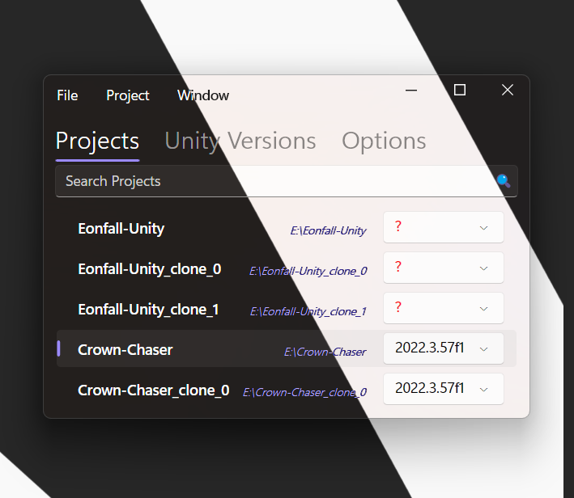

# Unity Hub Native .Net

**UnityHubNative.Net** is a lightweight C#/Avalonia alternative to the unnecessarily heavy official Unity Hub, built using [Avalonia](https://avaloniaui.net). This means that, instead of using heavy web components like the official Electron hub, it uses native GUI components on all platforms.

> This project is ***heavily*** inspired by [UnityHubNative](https://github.com/Ravbug/UnityHubNative). Any resemblance is a direct copying of the original project's style. This project aims to bring the project onto the modern UI framrwork of Avalonia in the already-familiar C# language from Unity developers for Unity developers.

It launches many times faster, uses far less memory and CPU, and is a fraction of the total size of the official Unity Hub.



## Features 🚀
- Open projects by from the list, or by using the search bar
- View Unity installs by double clicking them in the list views in the Editor Versions section
- Manage Unity installs
- Update projects to a Unity version of your choosing
- Modern Fluent2 theme, including support for dark and light mode and Mica blur for Windows
- Add an existing project to the list using the Add Existing button*
- *[TBA] Manage Unity licenses*
- *[TBA] Create new unity projects with templates, for any modern Unity version you have installed, with the Create New button*

UnityHubNative.Net does not have every feature that the official hub has, but it has most of them. UnityHubNative.Net serves as a shortcut to get into your projects faster. 

## Installation 🔧
This application is self-contained.
1. Open the [Releases](https://github.com/somedeveloper00/UnityHubNative.Net/releases) section, and download the version for your platform.
2. Place the executable anywhere. (Recommended `/Applications` on Mac, `C:\Program Files` on Windows, and `/opt` on Linux)
3. Double click to run

## Application data files 📂
This application stores its own files in an application data directory. If the application is behaving unexpectedly or is not working at all, try removing the folder at these locations:
- macOS: `~/Library/Application Support/UnityHubNative`
- Windows: `%APPDATA%/UnityHubNative`
- Linux: `~/UnityHubNative`
> Data path and data format are identical to [UnityHubNative](https://github.com/Ravbug/UnityHubNative)

## Compiling it yourself 🛠️
```
cd Widnows
dotnet publish -c Release -r win-x64
```

## Issues 🐞
Please report all problems in the [Issues](https://github.com/somedeveloper00/UnityHubNative.Net/issues) section of this repository. 
Make sure to include as many details as possible.

## Contact 📧
If you have any questions, feel free to contact me at [barari.saeed.am@outlook.com](mailto:barari.saeed.am@outlook.com?subject=NativeUnityHub.Net%20Inquiry&body=Hello,%20I%20have%20a%20question%20about%20your%20project.)
